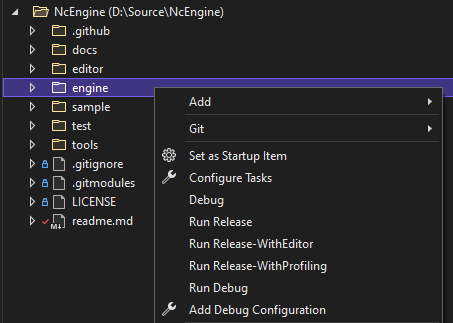

# NcEngine
[](https://github.com/McCallisterRomer/NCEngine/actions?query=workflow%3ATests)
[](https://github.com/McCallisterRomer/NCEngine/blob/vnext/LICENSE)

<p align="center">
  
</p>

NcEngine is a 3D game engine written in C++20 targeting Windows. It is actively being developed but is still in very early stages. Features are in varying stages of completeness.

-------------------
* Getting Started
    * [Requirements](#requirements)
    * [Building](#building)
    * [Definitions](#definitions)
* More Information
    * [Overview](docs/Overview.md)
    * [Creating a Project](docs/CreatingAProject.md)
    * [NcEngine Components](docs/EngineComponents.md)

### Requirements
----------------
* Windows
* Vulkan SDK
* CMake 3.20
* Compiler with c++20 support:
    * Visual Studio 17 2022
    * MinGW-w64 9.0.0

> When cloning, use `--recurse-submodules`. If any subdirectories of nc/external are empty, the repo was cloned non-recursively. Use `git submodule update --init` to get the dependencies.

## Building
------------
### SDK
Build and install with CMake. Set the install prefix to :
```
cmake -G "Visual Studio 17 2022" -S ./ -B build/dev -DCMAKE_INSTALL_PREFIX=install
cmake --build build/dev --target install --config Release
```

The install prefix 

### Tests
```
cmake -G "Visual Studio 17 2022" -S test -B build/test
cmake --build build/test --config Release
ctest --test-dir build/test
```

## Targets
-----------

The following components will be installed to `Install-Prefix/NcSdk-Version/Component-Name`:

### NcEngine
Core engine library

### NcEditor
Application for project creation and management.

### NcTools
Command line utilities and scripts for asset processing.

### Sample
Application containing demo, test, and benchmark scenes.

### Building in Visual Studio
-----------------------------

> Ensure CMake presets are enabled in Visual Studio: Tools > Options > CMake > Use CMakePresets.json to drive CMake configure, build and test.

Once cloned, open the repository in Visual Studio. The CMakePresets.json files should be automatically detected, displaying the Target System/Configuration/Build Preset dropdowns. Set the system to 'Local Machine' and select the desired NcEngine-MSVC option from the 'Configuration' menu. Update the 'Build' menu to match the configuration name, if it doesn't do so automatically. If configuration options are missing from the dropdown, first select 'Manage Configurations... (nc/CMakeLists.txt)'. A release build will look like:

<p align="center">
  
</p>

The configuration step should automatically start. Upon completion, build and install the engine. Once NcEngine is installed, NcEditor or the sample application may be built in the same way, excluding installation.

Configure, build, and install steps may be manually triggered from the 'Project' and 'Build' menus or from a target's context menu from the solution explorer in 'CMake Targets View'.

As an alternative: configure, build and install steps can be batched via build script through the included tools/tasks.vs.json file. The tasks are accessed via the context menu for the engine, sample, editor or test directories.

This allows for a one-click option to configure, build, and install (if required) the chosen target and any dependent targets.

To set these tasks up:

1. Copy the contents of tools/tasks.vs.json to the clipboard. 
2. Right click in the Solution Explorer and choose "Configure Tasks". 
3. Replace the tasks.vs.json file that just opened with the contents of the clipboard and save. 
This creates the context menu options that are wired up to invoke the build script.

<p align="center">
  
</p>

### Definitions
---------------
#### NC_PROD_BUILD
    Default = OFF
    Build only NcEngine, and build production binaries with editor code, debug rendering, and assertions stripped. These are the binaries used by the editor when building games.

    Note: A prod build may be installed to the same location as a standard build (binaries are named differently), but they still need a distinct build directory.

#### NC_EDITOR_ENABLED
    Default = ON
    Flag used by both CMake and NcEngine specifying whether to include the debug editor in the final executable. Some blocks of coded required only by the editor are wrapped in #ifdefs. If this value is set to ON, it must be passed when building both the engine library and your project.

#### NC_ASSERT_ENABLED
    Default = ON
    Enables extra checks through the NC_ASSERT macro. These are enabled by default, even in release builds, as they are unlikely to have a serious effect on performance.

#### NC_DEBUG_RENDERING_ENABLED
    Default = ON
    Allows rendering wireframe primitives for debugging purposes.

#### NC_PROFILING_ENABLED
    Default = ON
    Enabled profiling with Optick. This also requires the Optick application (https://www.optickprofiler.com) and the Optick
    shared library (nc/lib/libOptick.dll).

#### NC_VERBOSE_LOGGING_ENABLED
    Default = ON
    Flag used to enable extra logging of internal engine operations to the diagnostics file specified in config.ini.

## More Information
-------------------
To learn more:
* [An overview of NcEngine](docs/Overview.md)
* [Tutorial: Creating a Project](docs/CreatingAProject.md)
* [NcEngine Components](docs/EngineComponents.md)