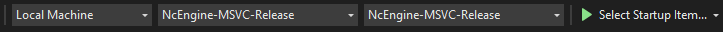

# NcEngine

<p align="center">
  
</p>

NcEngine is a 3D game engine written in C++20 targeting Windows. It is actively being developed but is still in very early stages. Features are in varying stages of completeness.

-------------------
* [Getting Started](#getting-started)
    * [Requirements](#requirements)
    * [Targets](#targets)
    * [Configuration and Presets](#configuration-and-presets)
    * [Building from Command Line](#building-from-command-line)
    * [Building in Visual Studio](#building-in-visual-studio)
    * [Definitions](#definitions)
* [More Information](#more-information)
    * [Overview](docs/Overview.md)
    * [Creating a Project](docs/CreatingAProject.md)
    * [NcEngine Components](docs/EngineComponents.md)

## Getting Started
------------

### Requirements
----------------
* Windows
* Vulkan SDK
* CMake 3.20
* Compiler with c++20 support:
    * Visual Studio 17 2022
    * MinGW-w64 9.0.0

> When cloning, use `--recurse-submodules`. If any subdirectories of nc/external are empty, the repo was cloned non-recursively. Use `git submodule update --init` to get the dependencies.

### Targets
-----------
There are three primary targets in the repository:
* NcEngine: Core Library
    * Type: Static Library
    * Directory: nc
* NcEditor: Application for project creation and management.
    * Type: Executable
    * Directory: editor
    * Dependencies: NcEngine [with -DNC_EDITOR_ENABLED=ON]
* Sample: Application containing demo, test, and benchmark scenes.
    * Type: Executable
    * Directory: project
    * Dependencies: NcEngine

NcEngine is the library games link against. NcEditor and the sample application are optional and depend on NcEngine being built *and* installed.

### Configuration and Presets
-----------------------------
Each target's root directory contains a CMakePresets.json file with common configuration and build presets for both Visual Studio and Ninja + MinGW. The available presets can be viewed with `cmake -S <target-source-dir> --list-presets`.

Each of these presets follows the naming scheme `<target>-<generator>-<configuration>-[modifier]`, where modifier describes optional features to include:
* WithEditor: Include editor-specific code.
* WithProfiling: Include Optick profiling code.
* WithValidation: Enable Vulkan validation layers.

Each preset provides a different set of [definitions](#definitions). When adding custom presets to CMakeUserPresets.json, NC_INSTALL_DIR must be defined.

More on CMake Presets:
* [Documentation](https://cmake.org/cmake/help/latest/manual/cmake-presets.7.html)
* [CMake Presets in Visual Studio](https://docs.microsoft.com/en-us/cpp/build/cmake-presets-vs?view=msvc-170)

### Building from Command Line
------------------------------
Each target can be configured and built with:

```
>cmake -S <target-directory> -B build/<Preset-Name> --preset <Preset-Name>
>cmake --build build/<Preset-Name>
```

NcEngine must be installed as well:
```
>cmake --install build/<Preset-Name>
```

An example building everything using Ninja and Release configuration with the editor extension:
```
>cmake -S nc -B build/NcEngine-Ninja-Release-WithEditor --preset NcEngine-Ninja-Release-WithEditor
>cmake --build build/NcEngine-Ninja-Release-WithEditor
>cmake --install build/NcEngine-Ninja-Release-WithEditor

>cmake -S editor -B build/NcEditor-Ninja-Release-WithEditor --preset NcEditor-Ninja-Release-WithEditor
>cmake --build build/Editor-Ninja-Release-WithEditor

>cmake -S sample -B build/Sample-Ninja-Release-WithEditor --preset Sample-Ninja-Release-WithEditor
>cmake --build build/Sample-Ninja-Release-WithEditor
```

More on available presets [here](#configuration-and-presets)

### Building in Visual Studio
-----------------------------

> Ensure CMake presets are enabled in Visual Studio: Tools > Options > CMake > Use CMakePresets.json to drive CMake configure, build and test.

Once cloned, open the repository in Visual Studio. The CMakePresets.json files should be automatically detected, displaying the Target System/Configuration/Build Preset dropdowns. Set the system to 'Local Machine' and select the desired NcEngine-MSVC option from the 'Configuration' menu. Update the 'Build' menu to match the configuration name, if it doesn't do so automatically. If configuration options are missing from the dropdown, first select 'Manage Configurations... (nc/CMakeLists.txt)'. A release build will look like:

<p align="center">
  
</p>

The configuration step should automatically start. Upon completion, build and install the engine. Once NcEngine is installed, NcEditor or the sample application may be built in the same way, excluding installation.

Configure, build, and install steps may be manually triggered from the 'Project' and 'Build' menus or from a target's context menu from the solution explorer in 'CMake Targets View'.

### Definitions
---------------
#### NC_INSTALL_DIR
    Default = install/NcEngine/${presetName}
    The directory NcEngine will be installed to.

#### NC_TESTS_ENABLED
    Default = OFF
    Flag used by cmake to enable building test executables.

#### NC_EDITOR_ENABLED
    Default = OFF
    Flag used by both CMake and NcEngine specifying whether to include the debug editor in the final executable. Some blocks of coded required only by the editor are wrapped in #ifdefs. If this value is set to ON, it must be passed when building both the engine library and your project.

#### NC_VULKAN_VALIDATION_ENABLED
    Default = OFF
    Enables Vulkan validation layers.

#### NC_DEBUG_RENDERING_ENABLED
    Default = OFF
    Allows rendering wireframe primitives for debugging purposes.

#### NC_PROFILING_ENABLED
    Default = OFF
    Enabled profiling with Optick. This also requires the Optick application (https://www.optickprofiler.com) and the Optick
    shared library (nc/lib/libOptick.dll).

#### NC_VERBOSE_LOGGING_ENABLED
    Default = OFF
    Flag used to enable extra logging of internal engine operations to the diagnostics file specified in config.ini.

## More Information
-------------------
To learn more:
* [An overview of NcEngine](docs/Overview.md)
* [Tutorial: Creating a Project](docs/CreatingAProject.md)
* [NcEngine Components](docs/EngineComponents.md)