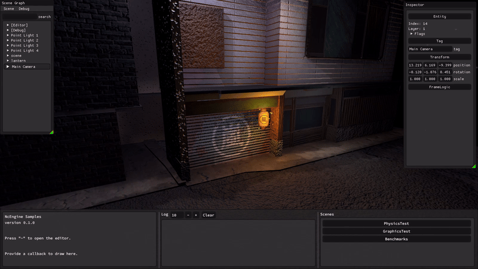

# NcEngine
[](https://github.com/NcStudios/NCEngine/actions?query=workflow%3ABuild)
[](https://ncstudios.github.io/NcEngine)
[](https://github.com/McCallisterRomer/NCEngine/blob/vnext/LICENSE)

<p align="center">
  
</p>

NcEngine is a 3D game engine written in C++23 using Vulkan. It is primarily for Windows but Linux support is in development.
It is actively being developed but is still in very early stages.

Currently featuring:
* Built-in, live editor
* Custom 3D physics
* Entity component system
* Modular architecture
* Skeletal animation
* Real time shadows
* Particle system
-------------------


<p align="center">
  
</p>


-------------------
* Getting Started
    * [Requirements](#requirements)
    * [Building](#building)
    * [Definitions](#definitions)
* More Information
    * [Documentation](https://ncstudios.github.io/NcEngine)
    * [Creating a Project](docs/CreatingAProject.md)
    * [NcEngine Components](docs/EngineComponents.md)

### Requirements
----------------
* Windows
* Vulkan SDK 1.3.211.0 or higher
* CMake 3.20
* Compiler with c++23 support:
    * Visual Studio 17 2022
    * MinGW-w64 9.0.0

## Building
---
Run CMake on the root CMakeLists with your required options:
```
cmake -S ./ -B build -DCMAKE_INSTALL_PREFIX=NcSdk
cmake --build build --target install --config Release
```

There is also a [build script](script/build.ps1) with optional parameters for configuring the generator and output directories:
```
script/build.ps1 -Generator msvc -BuildType Release
```

### Installation Items
* NcEngine: Engine libraries and headers.
  * To include in a CMake project use: `find_package(NcEngine PATHS install-path)` and link against `Nc::NcEngine-dev`.
* NcEditor: Application for project creation and management.
  * Application and utilities are installed to `install-path/bin`.
* Sample: Application containing demo, test, and benchmark scenes.
  * Installed to `install-path/sample`.

### Building a Production Library
While the default `Nc::Engine-dev` target can be built with a Release configuration, it still includes extra code for profiling and inspection by NcEditor that is otherwise not needed by the project itself. This can be excluded by defining `NC_PROD_BUILD=ON` during the CMake configure step. The target will instead be exported as `Nc::Engine`, and additional items, like NcEditor and the sample, will not be built. Unique build and install directories should be used when enabling and disabling this option.

### Definitions
---------------
#### NC_BUILD_TESTS
    Default: OFF
    Include tests when building the NcSdk project.

#### NC_PROD_BUILD
    Default: OFF
    Build binaries with debug, utility, and profiling code stripped. Only NcEngine is built, and its target name is changed to 'Nc::NcEngine' (dropping the '-dev' suffix). NcEditor uses this for project release builds.

#### NC_EDITOR_ENABLED
    Default: ON (OFF when NC_PROD_BUILD=ON)
    Flag used by both CMake and NcEngine specifying whether to include the debug editor in the final executable. Some blocks of coded required only by the editor are wrapped in #ifdefs. If this value is set to ON, it must be passed when building both the engine library and your project.

#### NC_ASSERT_ENABLED
    Default: ON (OFF when NC_PROD_BUILD=ON)
    Enables extra checks through the NC_ASSERT macro. These are enabled by default, even in release builds, as they are unlikely to have a serious effect on performance.

#### NC_PROFILING_ENABLED
    Default: ON (OFF when NC_PROD_BUILD=ON)
    Enabled profiling with Optick. This also requires the Optick application (https://www.optickprofiler.com) and the Optick
    shared library (installed to install-prefix/bin/OptickCore.dll).

#### NC_LOG_LEVEL
    Default: 2 (1 when NC_PROD_BUILD=ON)
    Flag used to control logging verbosity to the diagnostics file specified in config.ini. Set to 0, 1, or 2 for off, standard, or verbose.

## More Information
-------------------
To learn more:
* [Documentation](https://ncstudios.github.io/NcEngine)
* [Tutorial: Creating a Project](docs/CreatingAProject.md)
* [NcEngine Components](docs/EngineComponents.md)
