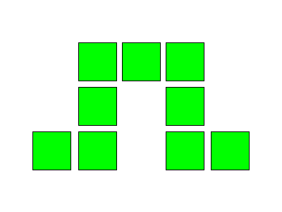

# NcEngine
[](https://github.com/NcStudios/NCEngine/actions?query=workflow%3ABuild)
[](https://ncstudios.github.io/NcEngine)
[](https://github.com/McCallisterRomer/NCEngine/blob/vnext/LICENSE)

<p align="center">
  
</p>

### About NcEngine
----------------
NcEngine is an open-source 3D game engine written in C++23 using Vulkan, primarily for Windows but Linux support is in development.
It is actively being developed but is still in early stages.

The purpose behind NcEngine:
1. To have access to a game engine that is completely free and open source and always will be. 
2. To own the entire game development pipeline, with minimal external dependencies. 
3. To learn exactly how games run, to be able to make architecture-informed decisions when making them.

What NcEngine is not:

> The purpose of NcEngine was never to be a product for others to purchase or pay for, or a general purpose game engine to compete with Unity, Unreal, Godot or others. We made this for our personal use, but it is now developed enough that we are happy to share with others. This repo is currently run by a two-person 'nights and weekends' team, so if you encounter a bug - please make an issue for it, but it will likely not be fixed soon (depending on severity). 


Currently featuring:
* Built-in, live editor
* Custom 3D physics
* Entity component system
* Modular architecture
* Skeletal animation
* Bindless rendering
* Real time shadows
* Particle system
* Audio clips
* PBR and toon shaders
* Custom asset types
-------------------


<p align="center">
  
</p>


### Getting Involved
----------------
Interested in getting involved?

The best way to help is to grab an issue that looks interesting an attempt to tackle it. Or, take the engine for a test drive and submit any found bugs.

Otherwise:

* [Support us on Patreon!](https://patreon.com/NCStudios499?utm_medium=unknown&utm_source=join_link&utm_campaign=creatorshare_creator&utm_content=copyLink)
* [X](https://twitter.com/ElrondHubbard01)
* [itch.io](https://ncstudios.itch.io/)
* [YouTube](https://www.youtube.com/@NightcrawlerGames)


### Getting Started
----------------
* Getting Started
    * [Requirements](#requirements)
    * [Building](#building)
    * [Definitions](#definitions)
* More Information
    * [Documentation](https://ncstudios.github.io/NcEngine)
    * [Creating a Project](docs/CreatingAProject.md)
    * [NcEngine Components](docs/EngineComponents.md)

### Requirements
----------------
* Windows
* Vulkan SDK 1.3.211.0 or higher
* CMake 3.20
* Compiler with c++23 support:
    * Visual Studio 17.2 2022
    * GCC 13

## Building
---
Run CMake on the root CMakeLists with your required options:
```
cmake -S ./ -B build -DCMAKE_INSTALL_PREFIX=NcSdk
cmake --build build --target install --config Release
```

There is also a [build script](script/build.ps1) with optional parameters for configuring the generator and output directories:
```
script/build.ps1 -Generator msvc -BuildType Release
```

### Installation Items
* NcEngine: Engine libraries and headers.
  * To include in a CMake project use: `find_package(NcEngine PATHS install-path)` and link against `Nc::NcEngine-dev`.
* NcEditor: Application for project creation and management.
  * Application and utilities are installed to `install-path/bin`.
* Sample: Application containing demo, test, and benchmark scenes.
  * Installed to `install-path/sample`.

### Building a Production Library
While the default `Nc::Engine-dev` target can be built with a Release configuration, it still includes extra code for profiling and inspection by NcEditor that is otherwise not needed by the project itself. This can be excluded by defining `NC_PROD_BUILD=ON` during the CMake configure step. The target will instead be exported as `Nc::Engine`, and additional items, like NcEditor and the sample, will not be built. Unique build and install directories should be used when enabling and disabling this option.

### Definitions
---------------
#### NC_BUILD_TESTS
    Default: OFF
    Include tests when building the NcSdk project.

#### NC_PROD_BUILD
    Default: OFF
    Build binaries with debug, utility, and profiling code stripped. Only NcEngine is built, and its target name is changed to 'Nc::NcEngine' (dropping the '-dev' suffix). NcEditor uses this for project release builds.

#### NC_EDITOR_ENABLED
    Default: ON (OFF when NC_PROD_BUILD=ON)
    Flag used by both CMake and NcEngine specifying whether to include the debug editor in the final executable. Some blocks of coded required only by the editor are wrapped in #ifdefs. If this value is set to ON, it must be passed when building both the engine library and your project.

#### NC_ASSERT_ENABLED
    Default: ON (OFF when NC_PROD_BUILD=ON)
    Enables extra checks through the NC_ASSERT macro. These are enabled by default, even in release builds, as they are unlikely to have a serious effect on performance.

#### NC_PROFILING_ENABLED
    Default: ON (OFF when NC_PROD_BUILD=ON)
    Enabled profiling with Optick. This also requires the Optick application (https://www.optickprofiler.com) and the Optick
    shared library (installed to install-prefix/bin/OptickCore.dll).

#### NC_LOG_LEVEL
    Default: 2 (1 when NC_PROD_BUILD=ON)
    Flag used to control logging verbosity to the diagnostics file specified in config.ini. Set to 0, 1, or 2 for off, standard, or verbose.

## More Information
-------------------
To learn more:
* [Documentation](https://ncstudios.github.io/NcEngine)
* [Tutorial: Creating a Project](docs/CreatingAProject.md)
* [NcEngine Components](docs/EngineComponents.md)
