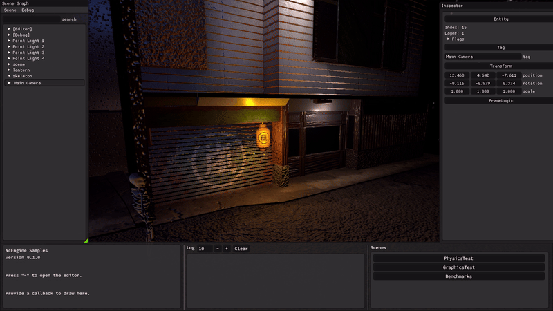

# NcEngine
[](https://github.com/NcStudios/NCEngine/actions?query=workflow%3ABuild)
[](https://ncstudios.github.io/NcEngine)
[](https://github.com/McCallisterRomer/NCEngine/blob/vnext/LICENSE)

<p align="center">
  
</p>

### About NcEngine
----------------
NcEngine is an open-source 3D game engine written in C++23 using Vulkan, primarily for Windows but Linux support is in development.
It is actively being developed but is still in early stages.

The purpose behind NcEngine:
1. To have access to a game engine that is completely free and open source and always will be. 
2. To own the entire game development pipeline, with minimal external dependencies. 
3. To learn exactly how games run, to be able to make architecture-informed decisions when making them.

What NcEngine is not:

> The purpose of NcEngine was never to be a product for others to purchase or pay for, or a general purpose game engine to compete with Unity, Unreal, Godot or others. We made this for our personal use, but it is now developed enough that we are happy to share with others. This repo is currently run by a two-person 'nights and weekends' team, so if you encounter a bug - please make an issue for it, but it will likely not be fixed soon (depending on severity). 


Currently featuring:
* Built-in, live editor
* Custom 3D physics
* Entity component system
* Modular architecture
* Skeletal animation
* Bindless rendering
* Real time shadows
* Particle system
* Audio clips
* PBR and toon shaders
* Custom asset types 
-------------------


<p align="center">
  
</p>


### Getting Involved
----------------
Interested in getting involved?

The best way to help is to grab an issue that looks interesting and attempt to tackle it. Or, make a game with the engine and let us know any shortcomings, bugs, or feature requests you discover along the way!

Otherwise:

* [X](https://twitter.com/ElrondHubbard01)
* [itch.io](https://ncstudios.itch.io/)

### Getting Started
----------------
* Getting Started
    * [Requirements](#requirements)
    * [Building](#building)
    * [Definitions](#definitions)
* More Information
    * [Documentation](https://ncstudios.github.io/NcEngine)
    * [NcEngine Components](docs/EngineComponents.md)

### Requirements
----------------
* Windows (Official Linux support is in progress)
* Vulkan SDK 1.3.211.0 or higher
* CMake 3.20
* Visual Studio or GCC
    * We strive to stay as current as we can with C++ features, so latest versions are recommended
    * Check [CI](https://github.com/NcStudios/NCEngine/actions?query=workflow:Build) for what we currently use
    * We make an unofficial effort to support MinGW as well, though it is currently not in CI.


## Building
---
Run CMake on the root CMakeLists with your required options:
```
cmake -S ./ -B build -DCMAKE_INSTALL_PREFIX=NcSdk
cmake --build build --target install --config Release
```

### Dependencies
All dependencies are fetched during the CMake generate step. 
There are two other first party repos:
* [NcCommon](https://github.com/NcStudios/NcCommon)
  * Containing math and utility libraries.
* [NcTools](https://github.com/NcStudios/NcTools)
  * Containing a library and CMD line utility for handling assets.

### Installation Items
* NcEngine: Engine libraries and headers.
  * To include in a CMake project use: `find_package(NcEngine PATHS install-path)` and link against `Nc::NcEngine-dev`.
  * CMD line utilities are installed to `install-path/bin`.
* Sample: Application containing demo, test, and benchmark scenes.
  * Installed to `install-path/sample`.

### Building a Production Library
While the default `Nc::Engine-dev` target can be built with a Release configuration, it still includes extra code for profiling and inspection by NcEditor that is otherwise not needed by the project itself. This can be excluded by defining `NC_PROD_BUILD=ON` during the CMake configure step. The target will instead be exported as `Nc::Engine`, and additional items, like NcEditor and the sample, will not be built. Unique build and install directories should be used when enabling and disabling this option.

### Definitions
---------------
#### NC_BUILD_TESTS
    Default: OFF
    Include tests when building.

#### NC_BUILD_INTEGRATION_TESTS
    Default: OFF
    Include integration tests, which require a graphics driver, when building.

#### NC_PROD_BUILD
    Default: OFF
    Build engine binaries for use in production releases. This excludes the editor layer, sample app, removes some runtime checks, and limits logging. The engine target name is changed to 'Nc::NcEngine' (dropping the '-dev' suffix).

#### NC_PROFILING_ENABLED
    Default: OFF
    Enable profiling with Optick. This also requires the Optick application (https://www.optickprofiler.com) and the Optick shared library (installed to install-prefix/bin/OptickCore.dll).

#### NC_BUILD_NCCONVERT
  Default: ON for dev; OFF for prod
  Build the nc-convert command line utility for cooking assets.

## More Information
-------------------
To learn more:
* [Documentation](https://ncstudios.github.io/NcEngine)
* [NcEngine Components](docs/EngineComponents.md)
